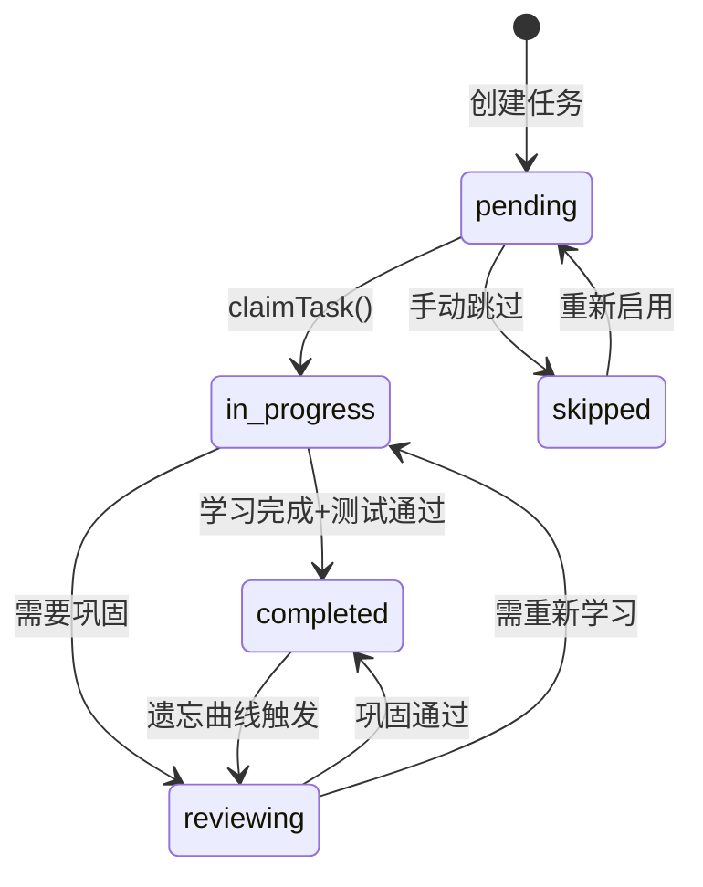
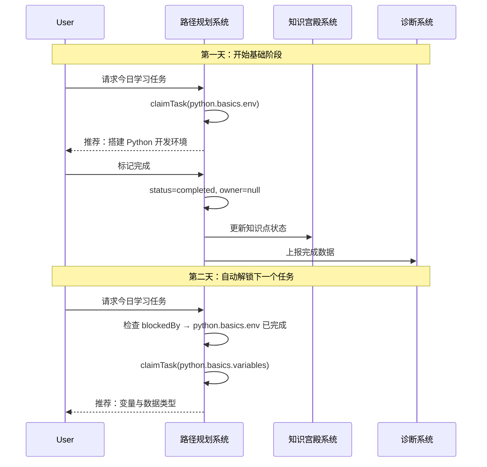

---
title: 03 - 路径规划系统（Plan / Revision）
tags: [A-Line, subsystem, task-system, learning-path, dependency-management]
---

# 03 路径规划系统 — 学习路径规划引擎

> **子系统定位**: 路径规划系统是 A-Line Human Learning OS 的"任务编排大脑"，负责将学习目标拆解为可执行的知识点任务链，管理任务的依赖关系、进度状态和原子持有权。它对应 CC 的 Task System（`tasks.ts`，779 行），将通用任务引擎映射为学习场景专用的路径规划器。

---

## 1. 系统定位 — 学习路径规划的 OS 角色

在 A-Line Human Learning OS 中，路径规划系统处于"承上启下"的核心位置：

- **承上**：接收来自 **16_学习方法诊断与路径推荐** 的诊断结果和建议路径，将其转化为可执行的任务计划。
- **启下**：为 **01_捕获系统（Capture）** 提供任务上下文，告诉捕获系统"当前要学什么"；为 **14_巩固系统（Consolidate）** 提供已完成任务的回顾清单。
- **横向协同**：与 **04_知识宫殿系统（Palace）** 交互，将知识点任务状态反映到知识宫殿的索引和回顾计划中；与 **06_学习画像系统（Profile）** 交互，将任务完成数据写入画像用于长期统计。

如果把 A-Line 比作一个操作系统，路径规划系统就是**进程调度器**——它决定哪个学习任务何时被执行，哪个任务需要等待前置条件，以及如何将用户有限的时间和精力分配给最高优先级的任务。

### 核心职责

| 职责 | 说明 |
|------|------|
| 任务分解 | 将学习目标拆解为粒度适当的知识点单元 |
| 依赖编排 | 根据知识间的先修关系建立依赖网络 |
| 进度跟踪 | 记录每个知识点的学习状态（未学/学习中/已掌握） |
| 原子持有 | 确保一个知识点在同一时间只被一个学习活动占用 |
| 动态调整 | 根据诊断结果动态调整任务优先级和顺序 |

---

## 2. 任务模型设计 — 将 CC Task 映射为学习路径步骤

### 2.1 核心数据模型

从 CC `tasks.ts` 的 Task 模型出发，我们将其扩展为学习场景专用的 `LearningTask`：

```typescript
interface LearningTask {
  id: string;                    // 唯一标识：如 "math.linear-algebra.vector-01"
  title: string;                 // 知识点标题
  description: string;           // 学习目标描述
  status: "pending" | "in_progress" | "completed" | "skipped" | "reviewing";
  owner: string | null;          // 当前持有者（学习会话 ID）
  blockedBy: string[];           // 前置依赖列表
  createdBy: string;             // 规划来源（诊断推荐 / 手动创建 / 系统预设）
  priority: 1 | 2 | 3;          // 优先级：1-高，2-中，3-低
  estimatedMinutes: number;      // 预估学习时长
  actualMinutes: number;         // 实际耗时
  tags: string[];                // 标签（便于检索和分类）
  masteryLevel: number;          // 掌握度 0-100（由测试/巩固系统更新）
  reviewInterval: number;        // 复习间隔（天），参考 FSRS 算法
  nextReviewAt: string | null;   // 下次复习时间
  createdAt: string;             // 创建时间
  completedAt: string | null;    // 完成时间
}
```

### 2.2 状态机

CC Task 的状态机只有三态（pending → in_progress → completed），我们扩展为五态并加入回退机制：



### 2.3 任务层级

学习路径不是扁平的 task 列表，而是三层层次结构：

```
LearningPath (学习路径)
  ├── Phase (阶段) — 如"基础阶段"、"进阶阶段"、"实战阶段"
  │   ├── Module (模块) — 如"线性代数基础"
  │   │   ├── Task (知识点任务) — 如"理解向量概念"
  │   │   ├── Task — 如"掌握矩阵运算"
  │   │   └── Task ...
  │   └── Module ...
  ├── Phase ...
```

这种层级设计来源于 CC 的 `taskList` 概念——多个 task 可以组成一个 taskList，对应于一个模块或一个阶段的学习目标。

---

## 3. 依赖管理 — blockedBy 机制在知识依赖链中的应用

### 3.1 知识依赖的本质

在学习中，知识点之间存在天然的依赖关系：**必须先学 A，才能学 B**。例如：

- 先学"变量"才能学"函数"
- 先学"函数"才能学"递归"
- 先学"微积分基础"才能学"神经网络"

CC 的 `blockedBy` 机制完美对应这一需求。每个 Task 可以声明一个 `blockedBy` 数组，列出其依赖的前置任务。

### 3.2 依赖检查流程

```typescript
function checkBlocked(task: LearningTask, allTasks: LearningTask[]): BlockedResult {
  // 1. 获取所有未完成的任务 ID
  const unresolvedIds = new Set(
    allTasks
      .filter(t => t.status !== "completed")
      .map(t => t.id)
  );

  // 2. 检查当前任务的 blockedBy 中是否有未完成的
  const blockingTasks = task.blockedBy.filter(id => unresolvedIds.has(id));

  // 3. 返回结果
  if (blockingTasks.length > 0) {
    return {
      blocked: true,
      blockedBy: blockingTasks,
      message: `需先完成: ${blockingTasks.join(", ")}`
    };
  }
  return { blocked: false, blockedBy: [] };
}
```

### 3.3 依赖图可视化

依赖关系形成有向无环图（DAG）。学习路径规划系统需保证：

1. **无环**：通过拓扑排序检测循环依赖
2. **可达性**：所有任务都可从某个入口任务到达
3. **层次性**：将依赖图分层，同一层（无相互依赖）的任务可并行学习

```
Python 学习路径示例：

        变量 ──→ 数据类型 ──→ 运算符 ──→ 流程控制 ──→ 函数
                                                          │
                                                          ↓
        列表 ──→ 字典 ──→ 文件操作 ←─── 异常处理 ←─── 函数进阶
          │
          ↓
        面向对象 ←── 继承 ←─── 封装 ←─── 类定义
          │
          ↓
        装饰器 ──→ 生成器 ──→ 模块与包
```

### 3.4 动态依赖调整

学习不是线性的——用户可能在某个知识点上卡住，需要回退补充前置知识。路径规划系统支持：

- **自动解阻塞**：当任务被阻塞时，自动推荐当前可学的前置任务
- **依赖降级**：高级用户可标记某些前置任务为"已掌握"以跳过
- **并行路径**：当任务无相互依赖时，提示用户可选择学习顺序

---

## 4. 原子 Claim 机制 — 学习任务的进度控制和持有

### 4.1 为什么需要原子 Claim

在 CC Task 系统中，`claimTask` 保证了在多 Agent 并发场景下每个任务只被一个 Agent 持有。映射到学习场景：

- 用户可能同时进行多个学习活动（如读教材 + 做练习 + 看视频）
- 需要保证同一个知识点不会同时被两个学习活动标记为"正在学习"
- 需要防止进度数据的竞态写入

### 4.2 Claim 流程

```typescript
function claimLearningTask(taskId: string, sessionId: string): ClaimResult {
  // 1. 获取文件锁（防止 TOCTOU 竞态）
  const release = await lockfile.lock(taskPath, LOCK_OPTIONS);

  try {
    // 2. 读取当前状态
    const task = readTask(taskId);

    // 3. 多重检查
    if (!task) return { success: false, reason: "task_not_found" };
    if (task.status === "completed") return { success: false, reason: "already_resolved" };
    if (task.owner && task.owner !== sessionId) {
      return { success: false, reason: "already_claimed", owner: task.owner };
    }

    // 4. 检查依赖阻塞
    const blockCheck = checkBlocked(task, allTasks);
    if (blockCheck.blocked) {
      return { success: false, reason: "blocked", blockedBy: blockCheck.blockedBy };
    }

    // 5. 写入 owner，变更状态
    task.owner = sessionId;
    task.status = "in_progress";
    writeTask(task);

    return { success: true };
  } finally {
    await release();
  }
}
```

### 4.3 学习场景中的 Claim 变体

| 场景 | 变体说明 |
|------|---------|
| 开始学习 | claimTask → 标记为 in_progress |
| 完成学习 | 释放 owner → 标记为 completed |
| 复习任务 | claimTaskWithBusyCheck → 检查是否在复习窗口内 |
| 暂停学习 | 释放 owner → 保持 in_progress（下次继续） |
| 跳过任务 | 强制 claim → 跳过依赖检查 → 标记为 skipped |

### 4.4 文件锁的替代方案

CC 使用文件锁（proper-lockfile）保证并发安全。A-Line 可以选型：

| 方案 | 适用场景 | 复杂度 |
|------|---------|--------|
| 文件锁 | 单机多进程 | 低 |
| SQLite 事务 | 单机数据库 | 中 |
| 内存锁 | 单进程应用 | 低 |
| 分布式锁 (Redis) | 多设备同步 | 高 |

对于初始版本，推荐使用 SQLite 事务 + WAL 模式，兼顾并发和持久化。

---

## 5. 与 16_学习方法诊断与路径推荐的对接

### 5.1 诊断 → 规划的转化流程

**16_学习方法诊断与路径推荐** 负责分析用户的学习状态（薄弱点、遗忘曲线、学习风格），输出诊断结果。路径规划系统将其转化为可执行的任务链：

```
诊断系统输出：
{
  "diagnosisId": "diag-2026-06-25-001",
  "weakAreas": [
    { "concept": "functional-programming", "mastery": 35, "urgency": "high" },
    { "concept": "recursion", "mastery": 50, "urgency": "medium" }
  ],
  "recommendedPath": [
    { "concept": "lambda-expressions", "order": 1 },
    { "concept": "higher-order-functions", "order": 2 },
    { "concept": "recursion", "order": 3 }
  ],
  "learningStyle": "visual"
}

↓ 路径规划系统转化 ↓

转换后的任务链：
1. lambda-expressions (pending, priority=high) ← 无依赖
2. higher-order-functions (pending, priority=high) ← blockedBy: [lambda-expressions]
3. recursion (pending, priority=medium) ← blockedBy: [higher-order-functions]
```

### 5.2 双向反馈

- **正向**：诊断系统 → 路径规划系统：生成/调整任务
- **反向**：路径规划系统 → 诊断系统：任务完成数据、卡住位置、耗时统计 → 用于下一轮诊断优化

### 5.3 周期同步

```
每日：
  诊断系统运行 → 输出薄弱点 → 规划系统调整优先级 → 更新今日学习计划

每周：
  诊断系统深度分析 → 输出推荐路径 → 规划系统重新排序 → 生成下周计划

每月：
  规划系统汇总完成数据 → 诊断系统做整体评估 → 调整长期学习路径
```

---

## 6. 学习路径示例 — 从"新手到掌握"的任务规划

### 6.1 场景：Python 编程入门

**学习目标**：从零基础到能编写简单的数据分析脚本

#### 阶段 1：基础语法（预估 2 周）

```json
[
  {
    "id": "python.basics.env",
    "title": "开发环境搭建（Python 安装 + VSCode）",
    "status": "pending",
    "blockedBy": [],
    "priority": 1,
    "estimatedMinutes": 60
  },
  {
    "id": "python.basics.variables",
    "title": "变量与数据类型（int, float, str, bool）",
    "status": "pending",
    "blockedBy": ["python.basics.env"],
    "priority": 1,
    "estimatedMinutes": 90
  },
  {
    "id": "python.basics.operators",
    "title": "运算符与表达式",
    "status": "pending",
    "blockedBy": ["python.basics.variables"],
    "priority": 1,
    "estimatedMinutes": 60
  },
  {
    "id": "python.basics.control-flow",
    "title": "流程控制（if/else, for, while）",
    "status": "pending",
    "blockedBy": ["python.basics.operators"],
    "priority": 1,
    "estimatedMinutes": 120
  },
  {
    "id": "python.basics.functions",
    "title": "函数定义与调用",
    "status": "pending",
    "blockedBy": ["python.basics.control-flow"],
    "priority": 1,
    "estimatedMinutes": 90
  }
]
```

#### 阶段 2：数据结构（预估 2 周）

```json
[
  {
    "id": "python.ds.lists",
    "title": "列表与元组",
    "status": "pending",
    "blockedBy": ["python.basics.functions"],
    "priority": 1,
    "estimatedMinutes": 90
  },
  {
    "id": "python.ds.dicts",
    "title": "字典与集合",
    "status": "pending",
    "blockedBy": ["python.basics.functions"],
    "priority": 1,
    "estimatedMinutes": 90
  },
  {
    "id": "python.ds.strings",
    "title": "字符串操作",
    "status": "pending",
    "blockedBy": ["python.basics.functions"],
    "priority": 2,
    "estimatedMinutes": 60
  },
  {
    "id": "python.ds.file-io",
    "title": "文件读写（打开、读取、写入 CSV）",
    "status": "pending",
    "blockedBy": ["python.ds.lists", "python.ds.strings"],
    "priority": 1,
    "estimatedMinutes": 120
  }
]
```

#### 阶段 3：数据分析入门（预估 2 周）

```json
[
  {
    "id": "python.data.numpy",
    "title": "NumPy 基础（数组操作）",
    "status": "pending",
    "blockedBy": ["python.ds.lists", "python.basics.functions"],
    "priority": 2,
    "estimatedMinutes": 120
  },
  {
    "id": "python.data.pandas",
    "title": "Pandas 基础（DataFrame 操作）",
    "status": "pending",
    "blockedBy": ["python.data.numpy", "python.ds.file-io"],
    "priority": 1,
    "estimatedMinutes": 180
  },
  {
    "id": "python.data.visualization",
    "title": "Matplotlib 基础（折线图、柱状图）",
    "status": "pending",
    "blockedBy": ["python.data.pandas"],
    "priority": 2,
    "estimatedMinutes": 90
  },
  {
    "id": "python.data.project",
    "title": "综合项目：分析销售数据并生成报告",
    "status": "pending",
    "blockedBy": ["python.data.pandas", "python.data.visualization"],
    "priority": 1,
    "estimatedMinutes": 240
  }
]
```

### 6.2 学习过程中的任务流转



### 6.3 复习计划的制定

路径规划系统不仅管理新知识的学习，还管理复习任务。复习任务的触发条件：

1. **遗忘曲线触发**：当某个 completed 任务的 `nextReviewAt` 到达时，自动创建复习子任务
2. **诊断触发**：当诊断系统检测到某个知识点掌握度下降时，提升其复习优先级
3. **周期触发**：每周自动生成本周所学内容的综合复习任务

复习任务使用 `reviewing` 状态，与主任务链并行运行，不阻塞新知识的学习。

---

## 7. 与其他子系统的接口定义

### 7.1 对外接口

```typescript
// 任务 CRUD
createLearningPath(path: LearningPath): string;
createTask(task: LearningTask): string;
getTask(taskId: string): LearningTask;
updateTask(taskId: string, updates: Partial<LearningTask>): void;
deleteTask(taskId: string): void;

// 学习流程
claimTask(taskId: string, sessionId: string): ClaimResult;
completeTask(taskId: string, masteryLevel: number): void;
skipTask(taskId: string): void;
unblockMe(): LearningTask[];  // 返回当前可学的任务

// 依赖管理
addDependency(taskId: string, dependsOn: string): void;
removeDependency(taskId: string, dependsOn: string): void;
getDependencyGraph(): DependencyGraph;
topologicalSort(): LearningTask[];

// 查询
listTasksByStatus(status: TaskStatus): LearningTask[];
listTasksByPhase(phaseId: string): LearningTask[];
getTodayPlan(): LearningTask[];  // 今日学习计划
getOverdueReviews(): LearningTask[];  // 过期复习任务
```

### 7.2 依赖关系

| 子系统 | 交互方式 | 数据流向 |
|--------|---------|---------|
| 01_捕获系统 | 提供任务上下文 | 规划 → 捕获 |
| 02_诊断系统 | 接收诊断结果，反馈任务数据 | 双向 |
| 04_知识宫殿 | 同步知识点状态 | 双向 |
| 06_学习画像 | 写入任务完成统计 | 规划 → 画像 |
| 14_巩固系统 | 提供巩固任务清单 | 规划 → 巩固 |
| 09_模板库 - 01_学习计划模板 | 格式参考 | 规划 → 模板 |

---

## 8. 总结

路径规划系统将 CC 的通用 Task 引擎转变为学习专用的任务编排器。其核心价值在于：

- **结构化的知识拆解**：将模糊的"学会 Python"转化为可执行的 50+ 个具体任务
- **依赖意识的路径**：保证学习序列符合认知规律，先修基础再上难度
- **原子化的进度控制**：每个知识点状态的变更都是原子操作，不会出现数据不一致
- **诊断驱动调整**：路径不是一成不变的，而是根据学习效果动态优化

这是 A-Line Human Learning OS 的核心调度组件，所有学习行为的发起和执行都围绕它展开。
