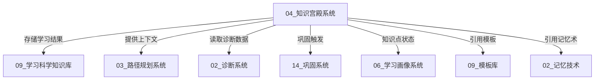
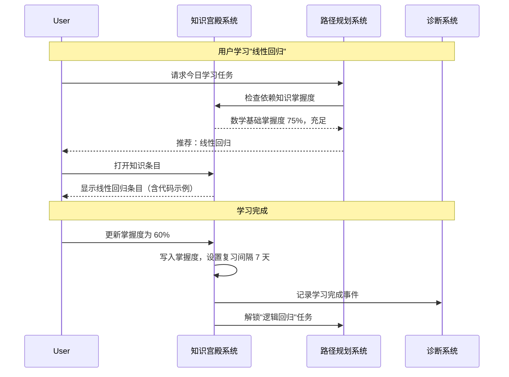

---
title: 04 - 知识宫殿系统（Palace / Memdir）
tags: [A-Line, subsystem, memory-palace, memdir, knowledge-organization]
---

# 04 知识宫殿系统 — 知识组织与检索中枢

> **子系统定位**: 知识宫殿系统是 A-Line Human Learning OS 的"长期记忆皮层"，负责学习所得知识的结构化存储、索引、相关性检索和生命周期管理。它对应 CC 的 memdir 系统（8 文件，1,635 行），将通用记忆目录管理映射为学习知识宫殿的构建和运维工具。

---

## 1. 系统定位 — 知识宫殿在 OS 中的角色

### 1.1 从"记忆宫殿"到"知识宫殿"

"记忆宫殿"（Memory Palace / Method of Loci）是古典记忆术中最高效的技术之一——将信息映射到熟悉的空间位置中，利用空间记忆的天然优势来增强回忆能力。

A-Line 的"知识宫殿系统"不是字面意义上的记忆宫殿训练工具（那在 **02_记忆技术/01_记忆宫殿与地点法.md** 中实现），而是一个**隐喻式的知识组织系统**：它把用户的整个知识体系组织成一座"宫殿"，每个房间（学科）、每个柜子（模块）、每个抽屉（知识点）都有固定的位置和索引，确保任何时候需要某个知识点都能快速找到。

### 1.2 OS 角色

| 角色 | 类比 | 职责 |
|------|------|------|
| 长期记忆皮层 | 人脑的长期记忆 | 持久化存储所有已学知识 |
| 图书馆管理系统 | Dewey 十进制分类法 | 知识条目的分类、编目、索引 |
| 检索引擎 | 搜索引擎 | 根据查询找到最相关的知识条目 |
| 知识压缩器 | 记忆巩固 | 当知识库过大时进行压缩和摘要 |

### 1.3 与其他子系统的关系



---

## 2. 记忆目录结构 — 如何组织知识条目

### 2.1 从 CC memdir 到知识宫殿目录

CC memdir 使用目录树来组织记忆文件：

```
memoryBaseDir/
├── MEMORY.md              ← 入口点（前 200 行/25KB 截断）
├── daily/                 ← 每日自动记录
├── projects/             ← 项目记忆
├── concepts/             ← 概念记忆
├── people/               ← 人物记忆
└── ...
```

A-Line 知识宫殿系统在此基础上进行学习场景定制：

```
knowledgePalace/
├── PALACE.md                    ← 宫殿索引入口（类比 MEMORY.md）
│                                 包含全学科概览、最近更新、热点知识
│
├── daily/                       ← 每日学习日志（类比 daily/）
│   ├── 2026-06-01.md
│   ├── 2026-06-02.md
│   └── ...
│
├── subjects/                    ← 学科目录（核心存储）
│   ├── programming/
│   │   ├── __index__.md         ← 学科索引（知识点清单+掌握度）
│   │   ├── python/
│   │   │   ├── __index__.md     ← 模块索引
│   │   │   ├── basics.md        ← 基础语法
│   │   │   ├── data-structures.md
│   │   │   └── advanced.md
│   │   ├── rust/
│   │   └── algorithms/
│   ├── mathematics/
│   │   ├── linear-algebra/
│   │   └── calculus/
│   └── ai-ml/
│       ├── deep-learning/
│       └── nlp/
│
├── cross-concepts/              ← 跨学科概念（类比 concepts/）
│   ├── abstraction.md
│   ├── feedback-loop.md
│   └── emergence.md
│
├── projects/                    ← 项目知识（类比 projects/）
│   ├── A-Line-OS/
│   └── personal-blog/
│
├── insights/                    ← 顿悟/心得（类比 lesson/）
│   ├── 2026-06-10-monad-insight.md
│   └── ...
│
└── archive/                     ← 归档（不再活跃的知识）
    └── deprecated-subject/
```

### 2.2 知识条目格式（Memory Cell）

每个知识条目是一个结构化 Markdown 文件，格式如下：

```markdown
---
id: "python.basics.variables"
title: "变量与数据类型"
subject: "programming/python"
tags: [python, beginner, data-types]
created: 2026-06-01
updated: 2026-06-10
mastery: 85
review_interval: 21
source: "course/python-crash-course"
relations:
  - type: "prerequisite"
    target: "python.basics.operators"
  - type: "extended_by"
    target: "python.advanced.type-hints"
---

## 核心概念

变量是存储数据的命名容器。Python 是动态类型语言，变量类型在运行时自动推断。

## 关键要点

- 变量命名规则：字母/下划线开头，区分大小写
- 基本类型：int, float, str, bool, NoneType
- type() 函数查看类型
- 动态类型 vs 静态类型

## 代码示例

```python
name = "Alice"
age = 30
pi = 3.14159
is_student = True
print(type(age))  # <class 'int'>
```

## 常见错误

- 使用未定义的变量 → NameError
- 类型混淆 → TypeError

## 关联知识点

- 见 `python.basics.operators`：运算符在变量上的操作
- 见 `python.advanced.type-hints`：Python 3.6+ 类型注解
```

### 2.3 记忆类型体系（映射 CC memoryTypes.ts）

CC 定义了 9 种记忆类型，我们将其映射为知识宫殿的学习场景类型：

| CC 类型 | A-Line 映射 | 说明 |
|---------|------------|------|
| project | subject/module | 学科或模块知识 |
| concept | cross-concept | 跨学科核心概念 |
| preference | learning-style-note | 学习偏好记录 |
| decision | method-decision | 学习方法选择决策 |
| pattern | knowledge-pattern | 知识模式（如算法模板）|
| person | expert-reference | 专家/参考来源 |
| resource | external-resource | 外部资源引用 |
| lesson | insight | 顿悟/学习心得 |
| goal | learning-goal | 学习目标与里程碑 |

---

## 3. 相关性检索 — 如何找到最相关的知识点

### 3.1 检索机制（映射 findRelevantMemories.ts）

CC 的 `findRelevantMemories.ts` 通过语义相关性检索找出最相关的记忆条目。A-Line 知识宫殿系统实现一个更丰富的检索栈：

```
查询请求（如："Python 闭包和装饰器的区别"）
    │
    ├── 1. 关键词检索
    │    └── 匹配标签 + 标题 + 内容关键词 → 候选集 A
    │
    ├── 2. 语义检索（可选，需本地嵌入模型）
    │    └── 向量语义相似度 → 候选集 B
    │
    ├── 3. 关系图检索
    │    └── 从"闭包"节点出发遍历知识图谱 → 候选集 C
    │
    ├── 4. 时效加权
    │    └── 最近学习/复习的知识点权重更高 → 候选集 D
    │
    └── 5. 结果融合排序
         └── RRF（Reciprocal Rank Fusion）→ 最终结果
```

### 3.2 检索评分函数

```typescript
interface SearchQuery {
  text: string;              // 查询文本
  tags?: string[];           // 限定标签
  subject?: string;          // 限定学科
  minMastery?: number;       // 最低掌握度
  maxResults: number;        // 最大结果数
}

interface SearchResult {
  cell: KnowledgeCell;       // 知识条目
  score: number;             // 综合评分 0-1
  matchedTerms: string[];    // 匹配的关键词
  relationPath?: string[];   // 如果是图检索，路径是什么
}

function search(query: SearchQuery): SearchResult[] {
  // 1. 关键词匹配（标题 + 标签 + 内容权重递减）
  const keywordResults = keywordSearch(query.text);

  // 2. 关系扩展（从匹配结果出发，沿 relation 边扩展）
  const expandedResults = expandViaRelations(keywordResults);

  // 3. 时效调整（参考 CC memoryAge.ts）
  const agedResults = applyFreshnessWeight(expandedResults);

  // 4. 排序与截断
  return rankAndTruncate(agedResults, query.maxResults);
}
```

### 3.3 记忆时效计算（映射 memoryAge.ts）

```typescript
function freshnessWeight(lastReviewDate: Date, masteryLevel: number): number {
  const daysSinceReview = daysBetween(lastReviewDate, new Date());

  // 根据掌握度动态调整遗忘速度
  // 高掌握度 → 遗忘慢 → 时效权重下降慢
  const decayRate = 0.5 + (1 - masteryLevel / 100) * 0.5;

  // 指数衰减
  return Math.exp(-decayRate * daysSinceReview / 30);
}

function freshnessLabel(lastReviewDate: Date): string {
  const days = daysBetween(lastReviewDate, new Date());
  if (days === 0) return "刚刚复习";
  if (days === 1) return "昨天复习";
  if (days < 7) return `${days}天前复习`;
  if (days < 30) return `${Math.floor(days / 7)}周前复习`;
  return `${Math.floor(days / 30)}月前复习`;
}
```

---

## 4. 记忆截断策略 — 当知识库过大时的压缩策略

### 4.1 CC memdir 的入口点截断

CC memdir 在加载入口点时进行截断：

```typescript
MAX_ENTRYPOINT_LINES = 200
MAX_ENTRYPOINT_BYTES = 25_000
```

A-Line 知识宫殿系统采用多层截断策略：

### 4.2 PALACE.md 入口截断

PALACE.md（目录入口点）需要在加载时截断：

- **默认截断**：最多保留 200 行或 25KB（参考 CC 参数）
- **智能截断**：优先保留一级索引（学科列表）+ 最近更新内容
- **按需加载**：用户或子系统需要特定学科时，才加载该学科的 `__index__.md`

### 4.3 知识条目的截断

单个知识条目过大时的处理：

```typescript
function truncateCell(cell: KnowledgeCell): TruncatedCell {
  const MAX_CELL_SIZE = 10_000;  // bytes

  if (cell.content.length <= MAX_CELL_SIZE) {
    return cell;
  }

  return {
    // 元数据始终完整保留
    ...cell.metadata,
    // 内容截断：保留核心概念 + 关键要点
    content: [
      extractSection(cell.content, "## 核心概念"),
      extractSection(cell.content, "## 关键要点"),
      extractSection(cell.content, "## 代码示例"),  // 如果有
      "\n\n*内容已截断，共省略 X 字，详见完整文件*"
    ].join("\n\n")
  };
}
```

### 4.4 知识库级压缩

当知识库增长到数万个条目时，需要整体压缩策略（参考 CC 的压缩机制）：

| 策略 | 触发条件 | 操作 |
|------|---------|------|
| 归档 | 1 年未访问 | 移入 archive/，仅在搜索时加载 |
| 合并 | 关联条目过多 | 将小条目合并为综述条目 |
| 摘要 | 条目超过 50KB | 使用 LLM 生成摘要版本 |
| 分层 | 单层条目 > 1000 | 引入新的子目录层级 |

### 4.5 自动路径生成（映射 paths.ts）

CC 的 `paths.ts` 管理自动记忆路径和每日日志路径。知识宫殿系统对应实现：

```typescript
// 获取今日学习日志路径
function getDailyLogPath(date: Date): string {
  const dateStr = formatDate(date);  // "2026-06-25"
  return path.join(knowledgePalaceDir, "daily", `${dateStr}.md`);
}

// 获取知识点存储路径
function getCellPath(taskId: string): string {
  const [subject, module, ...rest] = taskId.split(".");
  return path.join(
    knowledgePalaceDir,
    "subjects",
    subject,
    module,
    `${rest.join(".")}.md`
  );
}

// 扫描知识库索引
function scanPalace(): CellIndex[] {
  // 读取 subjects/ 下所有 __index__.md
  // 返回所有知识条目的元数据索引
}
```

---

## 5. 与 02_知识库的对接

### 5.1 引用 02_记忆技术

02_记忆技术（`02_记忆技术/`）提供了具体的记忆法训练方法，知识宫殿系统在与它们对接时扮演"应用层"角色：

| 记忆技术 | 在知识宫殿中的位置 | 集成方式 |
|---------|------------------|---------|
| 01_记忆宫殿与地点法 | subjects/ 使用地点命名 | 将学科目录命名为熟悉的地点，增强空间回忆 |
| 02_PAO记忆法 | cross-concepts/ 中的复杂概念 | 将抽象概念编码为人-动作-对象三元组 |
| 03_挂钩法与数字编码 | 知识条目 ID 系统 | 使用挂钩数字编码作为任务 ID 的后缀 |
| 04_联想链与图像化 | 关系图谱遍历 | 利用联想链在检索时做关系扩展 |
| 05_分块记忆 | 知识条目的粒度控制 | 确保每个条目"块"大小适中（7±2 要点） |

**具体对接示例**：

```markdown
<!-- 在知识条目中使用 PAO 记忆法 -->
---
tags: [python, decorator, PAO]
pao_encoding:
  person: "厨师（装饰器给函数"调味"）"
  action: "包裹（装饰器用新功能包裹原函数）"
  object: "三层蛋糕（@语法糖的语法结构）"
---
```

### 5.2 引用 09_模板库

09_模板库（`09_模板库/`）中的模板为知识宫殿的知识条目提供了编写规范：

- **01_学习计划模板** → 指导路径规划系统生成的任务如何写入知识宫殿
- **02_阅读笔记模板** → 知识条目的基础格式参考
- **05_案例拆解模板** → projects/ 中案例分析条目的模板
- **06_项目复盘模板** → 学习完一个模块后的回顾模板
- **07_每周复盘模板** → weekly-review 知识的生成格式

### 5.3 与 03_路径规划系统的双向同步

路径规划系统管理"学什么"，知识宫殿系统存储"学了什么"：

```
路径规划系统 → 更新知识库：
  claimTask("python.basics.variables")
  → 知识宫殿创建 cell "变量与数据类型"（status=in_progress）
  → 写入 subjects/programming/python/basics/variables.md

知识宫殿系统 → 通知路径规划系统：
  知识条目的掌握度 > 80%
  → 通知规划系统标记对应任务为可跳过复习状态
  → 生成下一阶段的学习路径
```

### 5.4 与 06_学习画像系统的对接

知识宫殿中的掌握度数据同步到学习画像系统：

```typescript
// 每完成一个知识点，同步掌握度到画像系统
function syncMasteryToProfile(cellId: string, mastery: number) {
  profileSystem.recordMastery({
    taskId: cellId,
    mastery: mastery,
    timestamp: new Date().toISOString(),
    subject: extractSubject(cellId)
  });
}
```

---

## 6. 宫殿构建示例 — 从分析到设计的完整实例

### 6.1 场景：构建"机器学习"知识宫殿

假设用户要学习"机器学习"领域。从分析到宫殿构建的完整流程：

#### 阶段 1：领域分析

首先对"机器学习"领域进行知识拆解，确定知识结构：

```
机器学习 (subject)
├── 数学基础 (module)
│   ├── 线性代数回顾
│   ├── 微积分基础（导数、梯度）
│   ├── 概率论与统计
│   └── 最优化方法
├── 经典机器学习 (module)
│   ├── 监督学习
│   │   ├── 线性回归
│   │   ├── 逻辑回归
│   │   ├── 决策树与随机森林
│   │   └── SVM
│   ├── 无监督学习
│   │   ├── K-Means 聚类
│   │   ├── 层次聚类
│   │   └── PCA 降维
│   └── 集成方法
│       ├── Bagging
│       └── Boosting
├── 深度学习 (module)
│   ├── 神经网络基础
│   ├── CNN
│   ├── RNN/LSTM
│   └── Transformer
└── 工程实践 (module)
    ├── scikit-learn
    ├── TensorFlow/PyTorch
    ├── 模型评估与调参
    └── MLOps 基础
```

#### 阶段 2：目录创建

```
knowledgePalace/subjects/ai-ml/
├── __index__.md                         ← 机器学习宫殿索引
├── math-foundation/
│   ├── __index__.md
│   ├── linear-algebra-review.md
│   ├── calculus-derivatives.md
│   ├── probability-stats.md
│   └── optimization.md
├── classical-ml/
│   ├── __index__.md
│   ├── supervised/
│   │   ├── linear-regression.md
│   │   ├── logistic-regression.md
│   │   ├── decision-tree.md
│   │   └── svm.md
│   ├── unsupervised/
│   │   ├── kmeans.md
│   │   ├── hierarchical-clustering.md
│   │   └── pca.md
│   └── ensemble/
│       ├── bagging.md
│       └── boosting.md
└── ...
```

#### 阶段 3：入口索引（__index__.md）

```markdown
---
subject: "ai-ml"
title: "机器学习知识宫殿入口"
total_cells: 27
mastery_avg: 42
created: 2026-06-01
updated: 2026-06-25
---

# 机器学习知识宫殿

## 知识统计

| 模块 | 条目数 | 平均掌握度 | 最近学习 |
|------|--------|-----------|---------|
| 数学基础 | 5 | 75% | 3天前 |
| 经典监督学习 | 4 | 45% | 1天前 |
| 经典无监督学习 | 3 | 30% | 1天前 |
| 集成方法 | 2 | 10% | 刚刚 |
| 深度学习 | 4 | 5% | 未开始 |

## 热点知识（需复习）

1. **线性回归** - 掌握度 60%，7天未复习
2. **梯度下降** - 掌握度 50%，5天未复习
3. **K-Means** - 掌握度 30%（新学，待巩固）

## 相关知识关联

- 线性回归 ↔ 逻辑回归（共享损失函数概念）
- 梯度下降 ↔ 神经网络反向传播（优化方法延伸）
- PCA ← 线性代数（特征值分解先修知识）
```

#### 阶段 4：一个完整的知识条目示例

```markdown
---
id: "ai-ml.classical-ml.supervised.linear-regression"
title: "线性回归"
subject: "ai-ml/classical-ml/supervised"
tags: [machine-learning, regression, supervised-learning, foundational]
created: 2026-06-20
updated: 2026-06-22
mastery: 60
review_interval: 7
relations:
  - type: "prerequisite_of"
    target: "ai-ml.classical-ml.supervised.logistic-regression"
  - type: "prerequisite_of"
    target: "ai-ml.deep-learning.neural-network-basics"
  - type: "extends"
    target: "ai-ml.math-foundation.optimization"
  - type: "uses"
    target: "ai-ml.math-foundation.calculus-derivatives"
---

## 核心概念

线性回归是最基础的回归算法，建模因变量与自变量的线性关系：y = wx + b

## 关键要点

- 最小二乘法：最小化预测值与真实值的平方差
- 梯度下降：通过迭代优化参数 w 和 b
- R² 评分：衡量模型的拟合程度
- 正则化：L₁ (Lasso) 和 L₂ (Ridge) 防止过拟合

## 代码示例

```python
from sklearn.linear_model import LinearRegression
model = LinearRegression()
model.fit(X_train, y_train)
print(f"R² score: {model.score(X_test, y_test):.3f}")
```

## 关联知识点

- 见 `ai-ml.math-foundation.calculus-derivatives`：梯度下降的数学基础
- 见 `ai-ml.math-foundation.optimization`：更多优化方法
- 见 `ai-ml.classical-ml.supervised.logistic-regression`：从回归到分类

## 个人笔记

学习注意：线性回归假设特征与目标有线性关系。在实践中先画散点图确认线性关系是否成立。
```

#### 阶段 5：宫殿的日常使用



### 6.2 知识回顾流程

每日学习开始时，知识宫殿系统自动生成回顾清单：

```typescript
function getDailyReviewList(): ReviewItem[] {
  const allCells = scanPalace();

  return allCells
    .filter(cell => {
      // 1. 遗忘曲线到期
      if (isReviewDue(cell)) return true;
      // 2. 掌握度低于阈值
      if (cell.mastery < 40) return true;
      // 3. 诊断系统标记为薄弱点
      if (diagnosisSystem.isWeakPoint(cell.id)) return true;
      return false;
    })
    .sort((a, b) => {
      // 优先级：掌握度低的 → 遗忘久的 → 诊断标记的
      return a.mastery - b.mastery || a.daysSinceReview - b.daysSinceReview;
    })
    .slice(0, 10);  // 每日最多回顾 10 个知识点
}
```

---

## 7. 与 CC memdir 的差异总结

| 维度 | CC memdir | A-Line 知识宫殿 |
|------|----------|---------------|
| 目标 | 为 AI Agent 提供记忆上下文 | 为人类学习者提供知识组织系统 |
| 存储单位 | 对话记忆、项目上下文 | 学科知识点、跨概念、学习心得 |
| 索引方式 | 线性入口截断 | 多层索引（学科→模块→条目）|
| 检索算法 | 语义相似度（向量） | 混合检索（关键词+语义+关系图）|
| 时效计算 | 简单天数计算 | 结合掌握度的指数衰减 |
| 类型体系 | 9 种通用类型 | 10 种学习专用类型 |
| 截断策略 | 单一入口截断 | 入口截断 + 条目截断 + 库级压缩 |

---

## 8. 总结

知识宫殿系统是 A-Line Human Learning OS 的知识中枢，将 CC memdir 的通用记忆管理范式转化为结构化的、面向人类学习者的知识组织系统。其核心设计理念是：

- **空间即分类**：目录结构本身就是知识分类法，找知识等于找位置
- **索引驱动的检索**：每层都有 `__index__.md`，从宫殿入口到具体条目只需三次跳转
- **时效感知的回顾**：结合遗忘曲线和掌握度，智能决定何时复习哪个知识点
- **关系即导航**：通过知识条目间的 relation 元数据，形成可遍历的知识图谱

这座知识宫殿不是静态的仓库——它随着学习过程不断生长、重组、压缩和优化，就像人脑的长期记忆系统一样。
