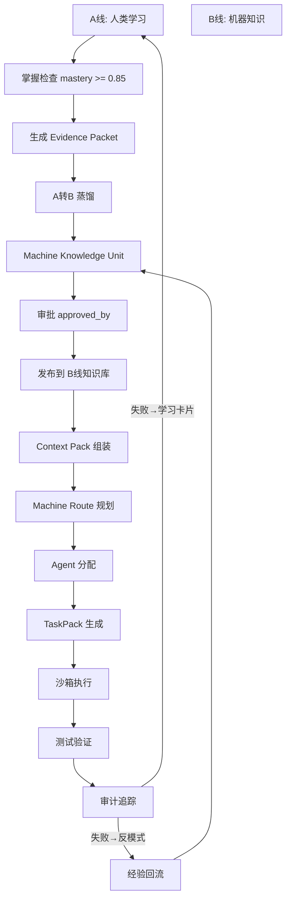

# 双线集成总方案 (A线 ↔ B线)

> Generated 2026-06-23 | Agent-5 (Lorentz)
> A线 = Human Learning OS | B线 = Machine Knowledge & Agent Execution OS

---

## 1. A到B的转译流程



---

## 2. 完整数据流图

```mermaid
flowchart LR
    subgraph External[外部输入]
        W[网页/文件/视频]
        GH[GitHub仓库]
        API[API/文档]
        PK[项目代码]
    end

    subgraph A_Line[A线: Human Learning OS]
        direction TB
        C[捕获 Capture]
        S[知识结构 Structure]
        D[诊断 Diagnose]
        P[路线 Plan]
        E[编码 Encode]
        R[复习 Remember]
        PA[宫殿 Palace]
        PR[训练 Practice]
        EX[实战 Execute]
        FB[反馈 Feedback]
        MC[元认知 Metacognition]
        TE[教学 Teach]
        CO[巩固 Consolidate]
        TR[A转B Translate]
    end

    subgraph Core[共享核心]
        direction TB
        KB[(Knowledge DB)]
        ENT[Entities/Relations]
        EV[Evolution Engine]
        AU[Audit Logger]
    end

    subgraph B_Line[B线: Machine Knowledge OS]
        direction TB
        MK[Machine Knowledge]
        CP[Context Pack]
        MR[Machine Route]
        MT[MCP Tools]
        AG[Agent Roles]
        TP[TaskPack]
        SB[Sandbox]
        EVAL[Eval/Audit]
        MM[Machine Memory]
        FL[Feedback Loop]
    end

    subgraph Agents[Agent执行]
        CODEX[CODEX Agent]
        DEEP[DEEP Workers]
    end

    W --> C
    GH --> C
    API --> C
    PK --> C
    C --> S --> D --> P --> E --> R --> PA --> PR --> EX --> FB --> MC --> TE --> CO --> TR

    A_Line --> Core
    Core --> B_Line

    TR --> |mastery approved| MK
    MK --> CP --> MR --> MT --> AG --> TP --> SB --> EVAL --> MM
    EVAL --> |success| FL
    EVAL --> |failure| FL
    FL --> |human learning card| A_Line
    FL --> |machine anti-pattern| MK

    TP --> CODEX
    TP --> DEEP
    CODEX --> |execution trace| EVAL
    DEEP --> |execution trace| EVAL
```



---

## 3. A→B 蒸馏门控条件

| 条件 | 阈值 | 说明 |
|------|------|------|
| mastery_score | >= 0.85 | 人掌握度达标 |
| review_count | >= 3 | 至少复习3次 |
| stability | >= 15 (天) | 记忆稳定 |
| evidence_count | >= 2 | 至少2条证据 |
| human_approval | required | 人工审批 |
| source_trust | >= 0.6 | 来源可信 |

---

## 4. B→A 回流机制

| 触发条件 | 回流目标 | 产物 |
|---------|---------|------|
| 执行失败 | A线卡片 | machine_error_card (间隔重复) |
| 工具调用错误 | B线反模式 | anti_pattern record |
| Agent分配失败 | B线经验 | machine_lesson |
| 测试不通过 | A线知识更新 | knowledge_update_candidate |
| 安全风险 | A线警告 | security_alert_card |
| 幻觉检测 | B线记忆 | hallucination_pattern |

---

## 5. 集成点优先级

```mermaid
gantt
    title 双线集成路线图
    dateFormat  YYYY-MM-DD
    section A线增强
    FSRS优化器+权重应用     :done, a1, 2026-06-20, 2026-06-23
    认知负荷系统            :active, a2, 2026-06-23, 2026-06-28
    记忆编码系统            :a3, 2026-06-28, 2026-07-05
    Rubric评分引擎          :a4, 2026-07-01, 2026-07-08
    学习画像系统            :a5, 2026-07-05, 2026-07-12
    费曼输出系统            :a6, 2026-07-08, 2026-07-15
    长期巩固系统            :a7, 2026-07-12, 2026-07-19
    A转B翻译系统            :a8, 2026-07-15, 2026-07-22
    section B线增强
    机器知识+上下文包       :active, b1, 2026-06-23, 2026-06-30
    机器路线规划            :b2, 2026-06-30, 2026-07-05
    MCP工具注册+权限        :b3, 2026-07-01, 2026-07-08
    Agent角色矩阵           :b4, 2026-07-05, 2026-07-12
    任务包生成(CODEX/DEEP)  :b5, 2026-07-08, 2026-07-15
    沙箱执行+审批           :b6, 2026-07-12, 2026-07-19
    评估审计+反馈学习       :b7, 2026-07-15, 2026-07-22
    section 集成对接
    A→B蒸馏管道             :milestone, m1, 2026-07-08
    B→A回流管道             :milestone, m2, 2026-07-15
    全链路测试              :milestone, m3, 2026-07-22
```

---

## 6. 关键集成点详解

### 6.1 A转B蒸馏管道 (P0)

```python
# pk_radar/b_line/a_to_b.py (已有框架)
def distill_to_machine_knowledge(card_id: int) -> MachineKnowledgeUnit:
    card = store.get_card(card_id)
    if not meets_distillation_criteria(card):
        raise DistillationError("mastery not sufficient")

    evidence_packet = build_evidence_packet(card)
    machine_unit = MachineKnowledgeUnit(
        title=card.title,
        content=card.content,
        source_type="A_line",
        source_entity_id=card_id,
        confidence=card.mastery_score,
        evidence=evidence_packet,
        status="pending",
    )
    store.create_machine_unit(machine_unit)
    return machine_unit
```

### 6.2 B→A回流管道 (P1)

```python
# pk_radar/b_line/feedback_loop.py (已有框架)
def feedback_to_a_line(trace: ExecutionTrace):
    if trace.status == "failed":
        card = CardTemplate(
            title=f"[B-Feedback] {trace.tool_name} execution failure",
            content=f"Tool: {trace.tool_name}\nError: {trace.error}\nPattern: {detect_pattern(trace)}",
            deck="machine-feedback",
        )
        store.create_card(card)
        # Also create anti-pattern if recurrent
        if is_recurrent_failure(trace):
            store.create_anti_pattern(trace)
```

### 6.3 共享核心 (P0 - 已实现)

| 组件 | 位置 | A线使用 | B线使用 |
|------|------|---------|---------|
| KnowledgeStore | pk_radar/core/store.py | CRUD所有表 | 读写机器知识 |
| Evolution Engine | pk_radar/core/evolution.py | 知识进化 | 机器经验进化 |
| Audit Logger | pk_radar/core/audit_logger.py | 学习审计 | 执行追踪 |
| AI System | pk_radar/core/ai_system.py | 编码/教学 | 评估/路由 |

---

## 7. 安全隔离边界

```text
┌─────────────────────────────────────────────────────────┐
│  A线 (Human)          │ 共享核心          │  B线 (Machine)   │
│                       │                   │                  │
│  学习记忆 ←→─────────→│ Entities/Relations│←→ 机器知识       │
│  卡片复习 ←→─────────→│ Evolution Engine │←→ 经验进化       │
│  元认知   ←→─────────→│ Audit Logger    │←→ 执行追踪       │
│                       │                   │                  │
│  ⚠ B线反馈             │  🛡 隔离规则       │  ⚠ 高风险操作     │
│  不能直接修改          │  来源必追踪        │  dry-run强制     │
│  A线长期记忆           │  结论需证据        │  approval门控    │
│                       │  错误必回流        │  trace全覆盖     │
└─────────────────────────────────────────────────────────┘
```

---

## 8. MVP集成交付顺序

```text
Week 1-2: MVP-1 (卡片+复习+错误) ✅ Done
Week 3-4: MVP-2 (宫殿+路径游走) + B线MVP-1 (机器知识+上下文包)
Week 5-6: MVP-3 (技能任务+Rubric) + B线MVP-2 (机器路线)
Week 7-8: MVP-4 (元认知+费曼输出) + B线MVP-3 (MCP工具)
Week 9-10: MVP-5 (巩固+A转B) + B线MVP-4/5/6 (Agent/任务包/审核)
```

---

## 9. 一句话总结

> A线确保"人真正掌握"，B线确保"机器安全执行"，A转B是两者之间的信任桥梁。
